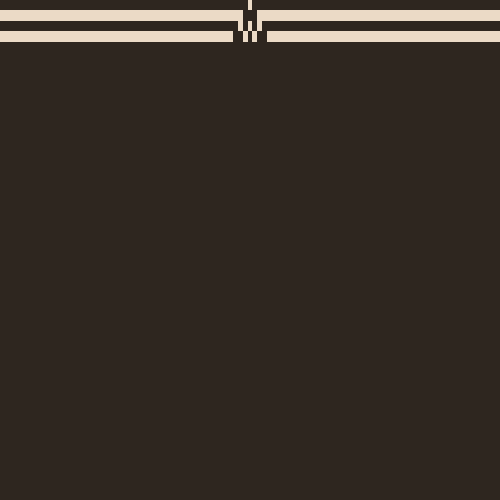

# A Collection of Mathematical Visualisations

These visualations are created using the matplotlib.animation library.

At the moment the main contents of this repository is cellular automata, as they provide interesting visualiations.

## 

## Conways game of life.

Cells can be in one of two states, alive or dead. The state in which the cell is in is dependdant on the number of neighbours around the cell.

[Game of life wiki page](https://en.wikipedia.org/wiki/Conway%27s_Game_of_Life?useskin=vector)

## Wolfram codes.

A 1-D cellular automata that can create interesting patterns if each frame is layered under the last. There are 255 total wolfram codes however many of them are chiral. Here are just a couple of my favourites :)

## Langtons ant

An ant moves a unit forward, if the square below it is a 1, the ant turns 90 degreees clockwise and the square becomes a zero. If the square below it is a 0 the ant turns 90 degrees anti-clockwise and the square bedomes a 1. 

